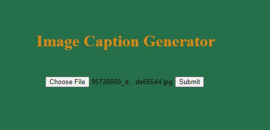
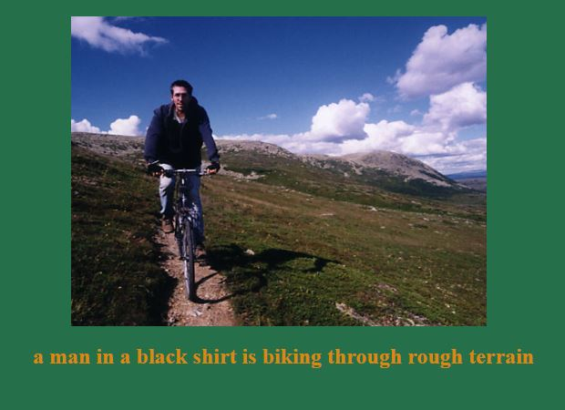

<h3>Image Caption Generator</h3>

<h2>Introduction</h2>
 The project is based on Natural Language processing(NLP) and Computer Vision where the caption of the image is generated by uploading the image. Both CNN and LSTM model is used to build the model. CNN which encodes the features in the image and LSTM which encode the text sequence which then merge together to make final prediction. For CNN Inception V3 architecture is used for extrating the features in the images and Glove embedding is used to encode the text sequences to 50 dimensional vector. The datasets for this project is small lightweight FLickr8k datasets which consists the 8000 images and each images has 5 captions.
 

<h2>Aims of the project</h2>
 * Developing a CNN model and extracting the features of the images. 
 * Developing LSTM model which can predict the text sequence 
 * Combining CNN and LSTM model 
 * Developing a complete web based application 

<h2>Datasets</h2>
 I have taken the dataset from “Flickr8k datasets”. The dataset consists the total images of 8000 and each image consists of 5 caption in token.txt file. 8000 images is distributed into training data of 6000 validation data of 1000 and testing data of 1000 and each data consists of respective text file. 

<h2>Building a Model</h2>
 First transfer learning technique is used to build the model and extract the image features with Inception V3 architecture by discarding the last layer which is used for classification. GLove embedding technique is used to encode the text sequences (which are the set of unique alphabate from the datasets) to 50 dimensional vector. After that both CNN and GLove embedding are combined to build the final model which predicts the caption of the image 

<h1>Deployment of model</h1>
 While deploying model in the web application the trained final model is saved by h5 extension and is loaded in the flask framework which has the simple UI. 

<h1>Results after deploying in Flask Framework</h1>

     

